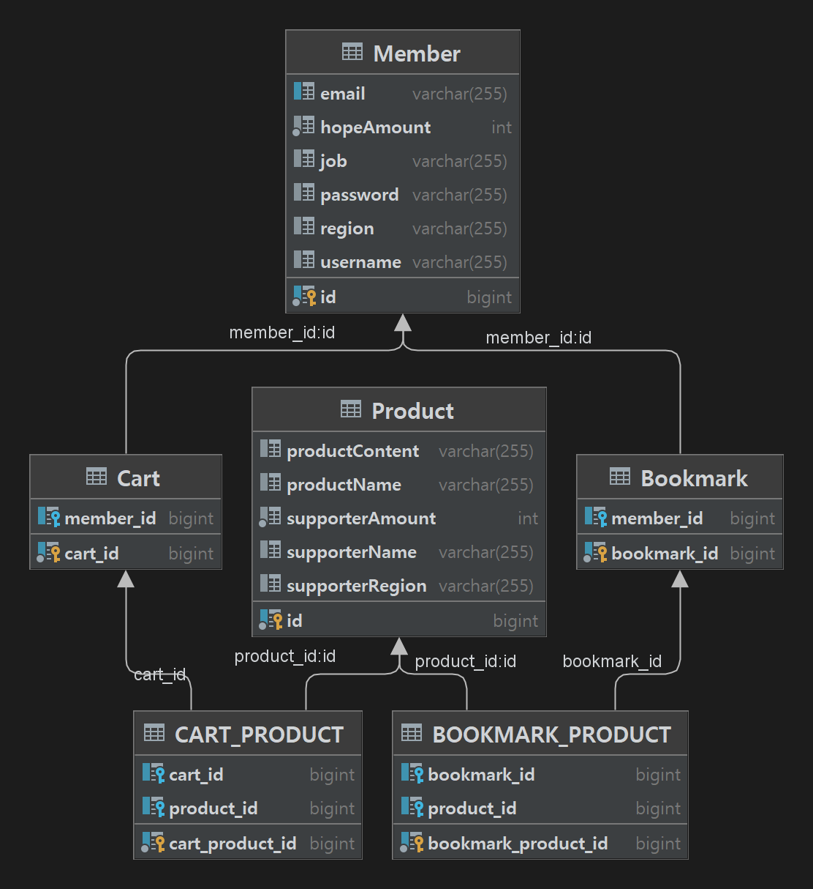

# Financial-Product-Recommendation-Service

## **팀원**
- 이원근
- 이창희
- 김대곤
- 고영민
---
## **개발 환경**

- IDE : IntelliJ
- JDK : 17
- DB : MySQL
- Spring Boot : 2.7.3
- Build : Maven
---
## **사용 기술**

- Spring Web
- Spring MVC
- Spring Data JPA
- Spring DevTools
- Spring Security
- Swagger
- JWT
---
## **ERD**

---
## **구현 목록**

- Member
    - 회원 가입
    - 로그인
    - 로그 아웃
    - 회원 수정
    - 회원 조회
- Product
    - 상품 목록
    - 맞춤 상품
    - 상품 조회
    - 상품 검색
      - "TITLE"과 "CONTENT"로 검색
- Cart
    - 장바구니 등록
    - 장바구니 목록 조회
    - 장바구니 삭제
    - 장바구니 신청
      - 신청하면 장바구니 비워지게만 구현
- Bookmark
    - 찜 등록
    - 찜 목록 조회
    - 찜 삭제
---
## **API 명세서**

[API 명세서 바로가기](https://www.notion.so/996655c9789b4fdfb5948e16f34628d6)
